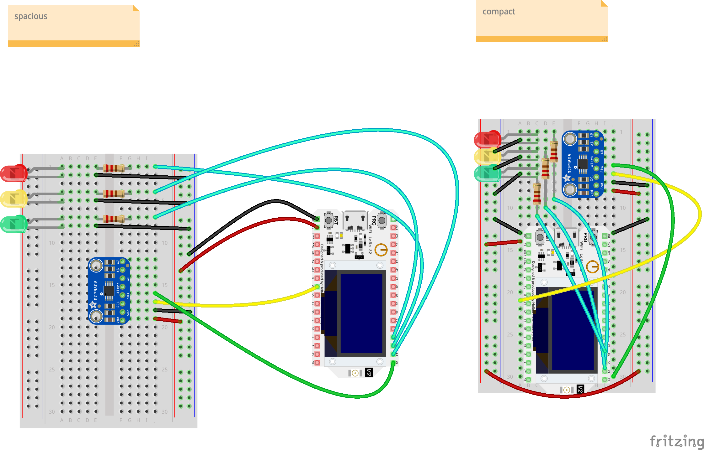

# Stadtpuls Temperatur Sensors

Basic Setup for running Adafruit MCP9808 temp sensors with Heltec Wifi Kit 32 v2 using Platformio.

## Setup

Install Platformio Core CLI (or the VSCode plugin) https://docs.platformio.org/en/latest/

```bash
cd path/to/this/folder/
# https://docs.platformio.org/en/latest/core/userguide/index.html

cp src/env.sample.h env.h
# Adjust the values in env.h with the Activation by Personalization (ABP) credentials for your device.
pio pkg install
pio run --target upload
pio device monitor --baud 115200 --eol LF
```

## Wiring

```plain
//                                             HELTEC WIFI Kit 32
// 
//                                      +-----------------------------+
//      MCP9808                         |                             |
//                                      |                             |
// +---------------+                    |                             |
// |               |                    |                             |
// |         VCC  -+- ---------------- -+-   5V                 5V   -+-
// |               |                    |                             |
// |         GND  -+- ---------------- -+-   GND               GND   -+- ----------------------+
// |               |                    |                             |                        |
// |         SCL  -+- ---------------- -+-   SCL                12   -+- -------^v^v-----> |---+
// |               |                    |                             |                        |
// |         SDA  -+- ---------------- -+-   SDA                13   -+- -------^v^v-----> |---+
// |               |                    |                             |                        |
// |          A0  -+-                   |                       14   -+- -------^v^v-----> |---+
// |               |                    |                             |
// |          A1  -+-                   |                             |         220 OHM  LED
// |               |                    |                             |
// |          A2  -+-                   |                             |
// |               |                    |                             |
// |       ALERT  -+-                   |                             |
// |               |                    |                             |
// +---------------+                    |                             |
//                                      |                             |
//                                      |                             |
//                                      |                             |
//                                      |                             |
//                                      |                             |
//                                      |                             |
//                                      +-----------------------------+
```

