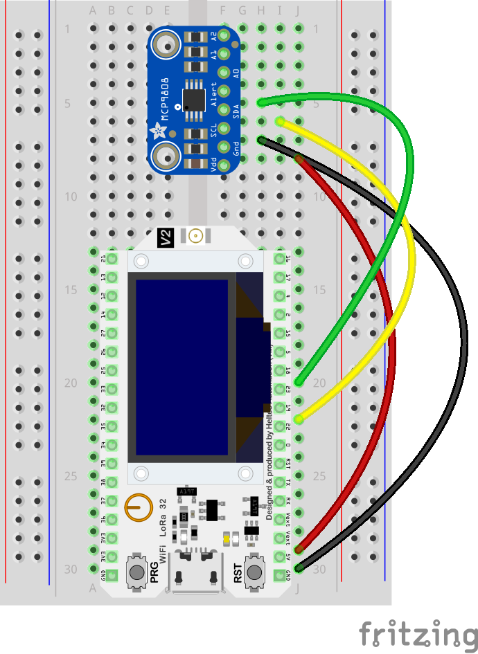

# Temperature over HTTP(s)

As seen on [republica 2022 in the makerspace](https://re-publica.com/en/node/359)

<!-- ALL-CONTRIBUTORS-BADGE:START - Do not remove or modify this section -->

[](#contributors-)

<!-- ALL-CONTRIBUTORS-BADGE:END -->

<!--

How to:

- You dont need to use every section. Only the ones that apply to your project.
- Adjust the files on .github/ISSUE_TEMPLATE/* how you need them
- Adjust the file on .github/CODEOWNERS to match your team
- If you use staging and main branches use this template for .github/renovate.json


```json
{
   "$schema": "https://docs.renovatebot.com/renovate-schema.json",
  "extends": [
    "@inpyjamas"
  ],
    "baseBranches": [
    "staging"
  ]
}
```

Bonus:

Use all-contributors

npx all-contributors-cli check
npx all-contributors-cli add ff6347 doc

You can use it on GitHub just by commeting on PRs and issues:

```
@all-contributors please add @ff6347 for infrastructure, tests and code
```
Read more here https://allcontributors.org/


Get fancy shields at https://shields.io
 -->

## Prerequisites

- PlatformIO - https://platformio.org/

## Installation

```bash
pip install platformio
# or
brew install platformio
```

## Usage & Development

```bash
# install all needed libraries
pio pkg install
# build the binary locally
pio run
# upload all the files in the ./data folder to the SPIFFS
pio run --target uploadfs
# upload the binary to the board
pio run --target upload
# see its output in the serial monitor
pio device monitor -b 115200
```

## Wiring

```txt
//                                             HELTEC WIFI Kit 32
//
//                                      +-----------------------------+
//      MCP9808                         |                             |
//                                      |                             |
// +---------------+                    |                             |
// |               |                    |                             |
// |         VCC  -+- ---------------- -+-   5V                      -+
// |               |                    |                             |
// |         GND  -+- ---------------- -+-   GND                     -+
// |               |                    |                             |
// |         SCL  -+- ---------------- -+-   SCL (22)                -+
// |               |                    |                             |
// |         SDA  -+- ---------------- -+-   SDA (23)                -+
// |               |                    |                             |
// |          A0  -+-                   |       to forget WiFi   39  -+
// |               |                    |       credentials connect   |
// |          A1  -+-                   |       pin 39 to VCC         |
// |               |                    |                             |
// |          A2  -+-                   |                             |
// |               |                    |                             |
// |       ALERT  -+-                   |                             |
// |               |                    |                             |
// +---------------+                    |                             |
//                                      |                             |
//                                      |                             |
//                                      |                             |
//                                      |                             |
//                                      |                             |
//                                      |                             |
//                                      +-----------------------------+
```



## Contributors

Thanks goes to these wonderful people ([emoji key](https://allcontributors.org/docs/en/emoji-key)):

<!-- ALL-CONTRIBUTORS-LIST:START - Do not remove or modify this section -->
<!-- prettier-ignore-start -->
<!-- markdownlint-disable -->
<table>
  <tr>
    <td align="center"><a href="https://fabianmoronzirfas.me/"><br /><sub><b>Fabian Morón Zirfas</b></sub></a><br /><a href="https://github.com/technologiestiftung/stadtpuls-sensors/commits?author=ff6347" title="Documentation">📖</a> <a href="#ideas-ff6347" title="Ideas, Planning, & Feedback">🤔</a> <a href="https://github.com/technologiestiftung/stadtpuls-sensors/pulls?q=is%3Apr+reviewed-by%3Aff6347" title="Reviewed Pull Requests">👀</a> <a href="https://github.com/technologiestiftung/stadtpuls-sensors/commits?author=ff6347" title="Code">💻</a></td>
    <td align="center"><a href="http://vogelino.com"><br /><sub><b>Lucas Vogel</b></sub></a><br /><a href="https://github.com/technologiestiftung/stadtpuls-sensors/commits?author=vogelino" title="Documentation">📖</a> <a href="#ideas-vogelino" title="Ideas, Planning, & Feedback">🤔</a> <a href="https://github.com/technologiestiftung/stadtpuls-sensors/pulls?q=is%3Apr+reviewed-by%3Avogelino" title="Reviewed Pull Requests">👀</a> <a href="https://github.com/technologiestiftung/stadtpuls-sensors/commits?author=vogelino" title="Code">💻</a></td>
    <td align="center"><a href="http://www.awsm.de"><br /><sub><b>Ingo Hinterding</b></sub></a><br /><a href="https://github.com/technologiestiftung/stadtpuls-sensors/commits?author=Esshahn" title="Documentation">📖</a></td>
  </tr>
</table>

<!-- markdownlint-restore -->
<!-- prettier-ignore-end -->

<!-- ALL-CONTRIBUTORS-LIST:END -->

This project follows the [all-contributors](https://github.com/all-contributors/all-contributors) specification. Contributions of any kind welcome!

## Content Licencing

Texts and content available as [CC BY](https://creativecommons.org/licenses/by/3.0/de/).

## Credits

<table>
  <tr>
    <td>
      Made by <a src="https://citylab-berlin.org/de/start/">
        <br />
        <br />
        
      </a>
    </td>
    <td>
      A project by <a src="https://www.technologiestiftung-berlin.de/">
        <br />
        <br />
        
      </a>
    </td>
    <td>
      Supported by <a src="https://www.berlin.de/rbmskzl/">
        <br />
        <br />
        
      </a>
    </td>
  </tr>
</table>

## Related Links

- Rui Santos - esp32 tutorials - https://RandomNerdTutorials.com/
- Adafruit_MCP9808_Library - examples (temp sensor) - https://github.com/adafruit/Adafruit_MCP9808_Library
- Adafruit_SSD1306_Library - examples (oled display) - https://github.com/adafruit/Adafruit_SSD1306
- Adafruit_GFX_Library - examples (oled display) - https://github.com/adafruit/Adafruit-GFX-Library
- espressif arduino-esp32 examples - https://github.com/espressif/arduino-esp32/
- Heltec_ESP32 - examples (board) - https://github.com/HelTecAutomation/Heltec_ESP32/
